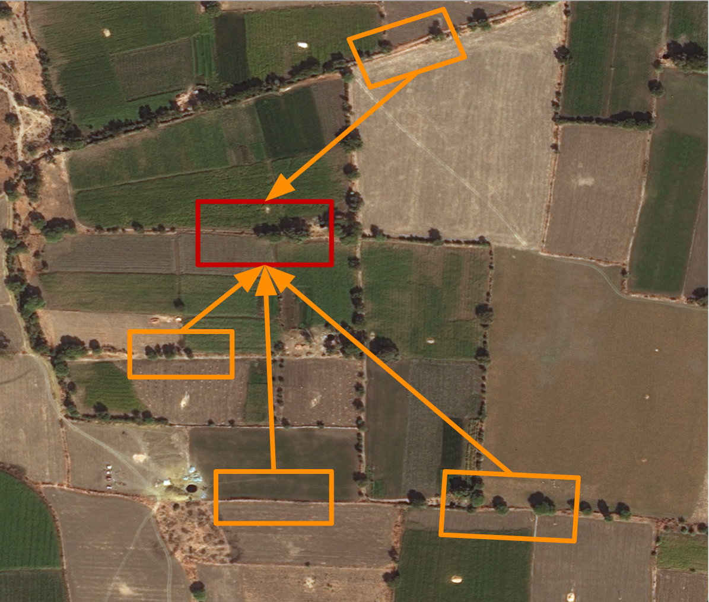
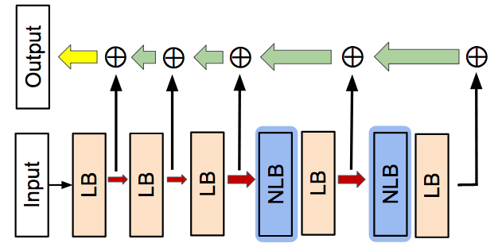
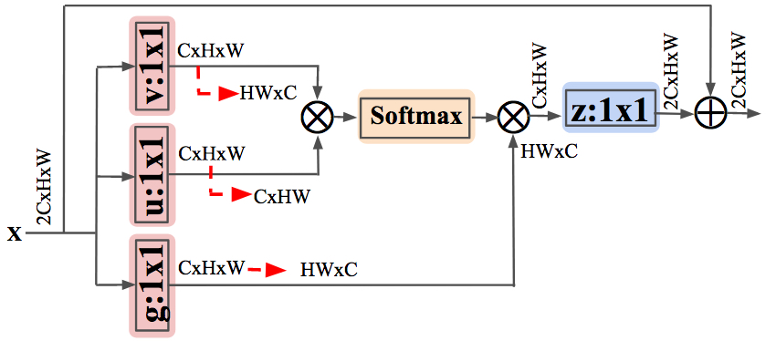
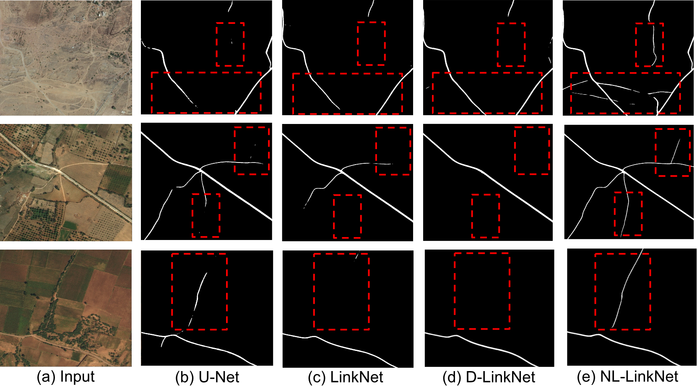
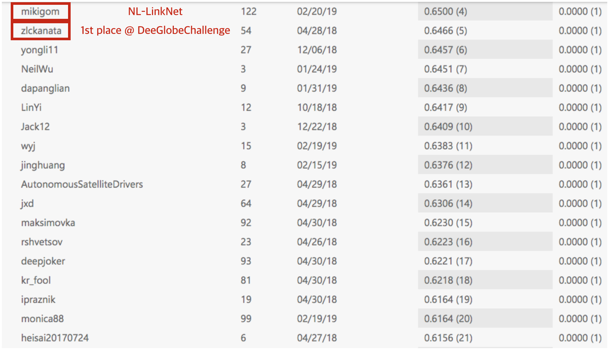
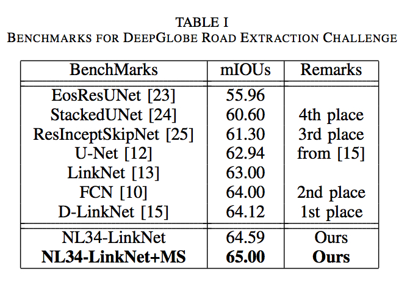
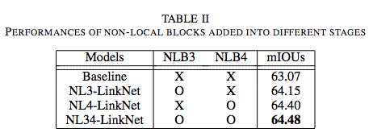
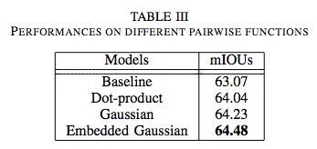

# NL-LinkNet for Road Extraction 
Pytorch implementation of **N**on-**L**ocal LinkNet (**NL-LinkNet**). It performs **65.00%** mIOU scores which is better than the 1st ranked single-model solution (D-LinkNet, 64.12%) in DeepGlobe Road Extraction Challenge. It also outperforms the ensemble of D-LinkNet, LinkNet, U-Net (64.66%). The referenced code can be found [here](https://github.com/zlkanata/DeepGlobe-Road-Extraction-Challenge).

This version is revised by 20 Feb, 2019 

## Basic Overview 
Since the VHR satellie images are taken at high distances, roads (red box) are likely to be covered by ostacles such as shadows, clouds, trees as a below figure. Therefore, capturing long-range dependencies (orange box) is essential. NL-LinkNet use nonlocal operations which compute feature map as a weighted sum of all pixels. It is a key to solve it. 

  
 

## Prerequisites
- Cuda 8.0
- Python 3.5 
- Torchvision 0.2.1 
- Torch 1.0.0 
- cv2 3.4.0 
- numpy, matplotlib, scikit-image, scipy, pickle, argparse

## Usage
Install prerequisites with: 

    pip3 install -r requirements.txt 

### Data
Place '*train*', '*valid*' and '*test*' data folders in the '*../dataset*' folder.

Data is from [DeepGlobe Road Extraction Challenge](https://competitions.codalab.org/competitions/18467#participate-get_starting_kit). You should sign in first to get the data.

Or you can use your own dataset by replacing images like: 
However, note that you cannot evaluate your own dataset file on the server. 

    ├── Road
    │   ├── train
    │   │   ├── *_sat.jpg 
    │   │   ├── *_mask.png 
    │   │   └── ...
    │   ├── test
    │   │   ├── *_sat.jpg 
    │   │   └── ...
    │   └── valid
    │       ├── *_sat.jpg
    ├──────── ...

### Train

**To train** model in different settings (locations, pairwise functions), please refer [here](https://github.com/yswang0522/NLLinkNetRoadExtraction/blob/master/run_example.sh)

To train **NL-LinkNet**(general):

    python3 train.py --model model_name --name 'name of weights and logs' --crop_size 1024 1024 --init_lr 0.0003 --dataset '../path/of/train/datasets' --load ""

To train **NL34-LinkNet**

    python3 train.py --model NL34_LinkNet --name 'NL34_LinkNet' --crop_size 1024 1024 --init_lr 0.0003 --dataset '../dataset/Road/train/' --load ""

To train **NL34-LinkNet** with **pretrained_weights** at 'weights/NL34_LinkNet.th' (Download it from Dropbox) 

    python3 train.py --model NL34_LinkNet --name 'NL34_LinkNet' --crop_size 1024 1024 --init_lr 0.0003 --dataset '../dataset/Road/train/' --load "NL34_LinkNet"

### Predict

To generate mask images: 

    python3 test.py --model model_name --name 'name_of_weights' --source 'path of input images' --scales 1.0 --target 'name_of_output_dir'
    
To generate mask images with NL34_LinkNet **without** multi-scaled test (MS) : 

    python3 test.py --model NL34_LinkNet --name 'NL34_LinkNet' --source '../dataset/Road/valid' --scales 1.0 --target 'NL34_LinkNet'

To generate mask images with NL34_LinkNet **with** multi-scaled test (MS) : 

    python3 test.py --model NL34_LinkNet --name 'NL34_LinkNet' --source '../dataset/Road/valid' --scales 0.75 1.0 1.25 --target 'NL34_LinkNet_MS'

### Download trained NL4-LinkNet

Please download this file to 'weights/'

- NL4-LinkNet : [Dropbox](https://www.dropbox.com/s/ra6i25wswmsu6y0/NL34_LinkNet.th?dl=0) (64.40%, 64.90% w/ MS[0.75,1.0,1.25])
- NL34-LinkNet : [Dropbox](https://www.dropbox.com/s/ra6i25wswmsu6y0/NL34_LinkNet.th?dl=0) (64.59%, 65.00% w/ MS[0.75,1.0,1.25])

## Methods

### 1. NL-LinkNet Architecture 
NL-LinkNet is composed of local block (LB) and non-local block (NLB). We employee ResNet34 as our LB according to sate-of-the-art (D-LinkNet)  

 
     

 

### 2. A Non-local block 
Nonlocal block computes weighted sum of all pixels for an output pixel. We consider three candidates of pairwise function f. This is an example of Gaussian version f. More details are described in paper. 

     

## Results 

### 1. Visual Comparison 

  
 

### 2. Quantitative Comparison 
This is leaderboard of [DeepGlobe Road Extraction Challenge](https://competitions.codalab.org/competitions/18467) @ CodaLab

csv file is [here](https://github.com/yswang0522/NLLinkNetRoadExtraction/blob/master/imgs/DeepGlobe_Road_Extraction_Challenge_results.csv)

  

This is quantitative comparison of our best models with the previous state-of-the-art models in challenge. 

  

### 3. Results on different locations of NLBs

  
 

### 4. Results on Different pairwise functions 

  
 

## Author 

Yooseung Wang / [@yswang0522](https://github.com/yswang0522) 

Junghoon Seo / [@mikigom](http://kimigom.github.io)

Taegyun Jeon / [@tgjeon](https://github.com/tgjeon)
